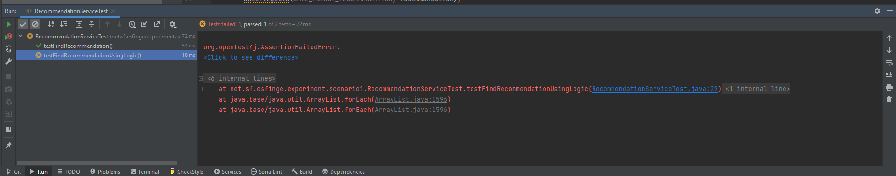

# 🛒 Product Recommendation System – Greensfinge Experiment

This project simulates a simplified product recommendation system, commonly found in e-commerce platforms. It is part of an experiment designed to demonstrate how energy-saving strategies can be integrated into Java applications **without** using the **Greensfinge Framework**.

Imagine a product recommendation system on an e-commerce platform. Every time a user accesses a product page, the system gathers statistics and displays suggestions based on popularity for an example:

"JBL 510BT Bluetooth Headphones received 1,231 visits this month.
Also check out HyperX Cloud Stinger Headphones!"

These insights are useful but not always essential — especially when the goal is simply to demonstrate the interface, for example.

---

## 📦 Project Structure

The project follows the standard layered architecture with separate packages for service, entity and repository.

## ✅ Description

- `entity.Recommendation`: Contains the business entity class.
- `service.RecommendationService`: Contains the business logic to format a recommendation.
- `repository.RecommendationRepository`: Simulates a database to search the values.

### ❓ Task

In the RecomendationService class, the method findRecomendation() search for the product and the number of visits. Currently this method also returns another product suggestion. To save energy when the user don't want to see his additional suggestion, you need to implement the functionality to make this second suggestion optional.

To implement this functionality, when the new method saveConsumptionEnergy() is called with the parameter "true", the second suggestion should be disabled. The method saveConsumptionEnergy() is empty and you need to implement it as part of your task.

---

## 🧪 Unit Tests

The test class `RecommendationServiceTest` validates the behavior of the recommendation logic.

When you open the project, to make sure that everything is correctly configured, you need to run the tests and the result should be the one in the picture: one test will pass and the other not. When you make all tests pass successfully, your task is complete.

> `IMPORTANT: You cannot change the test code!`

